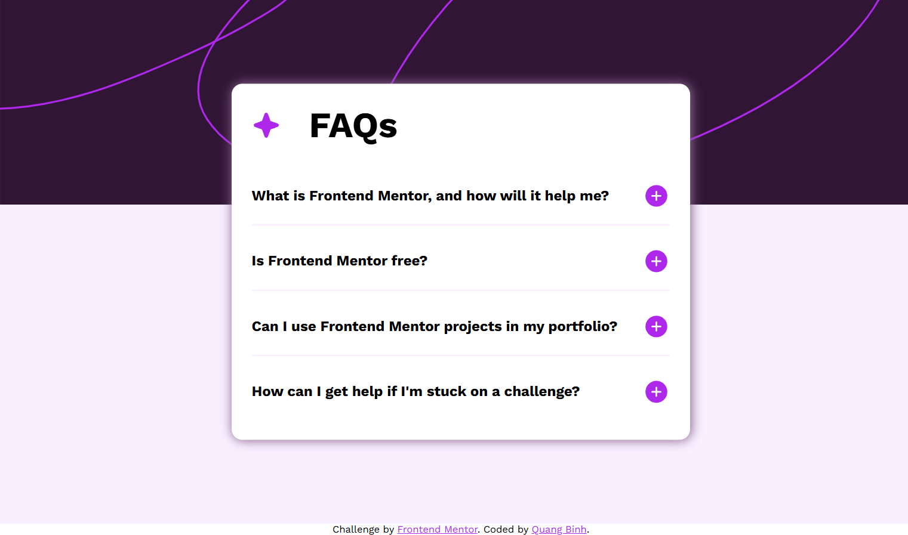

# Frontend Mentor - FAQ accordion solution

This is a solution to the [FAQ accordion challenge on Frontend Mentor](https://www.frontendmentor.io/challenges/faq-accordion-wyfFdeBwBz). Frontend Mentor challenges help you improve your coding skills by building realistic projects. 

## Table of contents

- [Overview](#overview)
  - [The challenge](#the-challenge)
  - [Screenshot](#screenshot)
  - [Links](#links)
- [My process](#my-process)
  - [Built with](#built-with)
  - [What I learned](#what-i-learned)
  - [Continued development](#continued-development)
- [Author](#author)
- [Acknowledgments](#acknowledgments)

## Overview

### The challenge

Users should be able to:

- Hide/Show the answer to a question when the question is clicked
- Navigate the questions and hide/show answers using keyboard navigation alone
- View the optimal layout for the interface depending on their device's screen size
- See hover and focus states for all interactive elements on the page

### Screenshot

### Links

- Solution URL: [Solution here](https://github.com/nqbinh98/faq-accordion)
- Live Site URL: [Live site here](https://nqbinh98.github.io/faq-accordion/)

## My process

### Built with

- Semantic HTML5 markup
- CSS custom properties
- Flexbox
- CSS Grid
- Mobile-first workflow
- JS

### What I learned
During this project, I gained a deeper understanding of handling interactive UI components. Specifically:
- Accordion Logic: Implemented an accordion using max-height and transition for smooth animations, moving away from simple display: none.
- Event Delegation: Used event bubbling to handle clicks efficiently on the container instead of attaching listeners to every single icon.
- Responsive Design: Utilized the <picture> element to handle different background assets based on the device width, ensuring better performance.

### Continued development
While the accordion is functional and responsive, I would like to focus on the following areas in future iterations: Accessibility (a11y) Improving keyboard navigation and screen reader support for the accordion items.

## Author

- Website - [@nqbinh98](https://github.com/nqbinh98)
- Frontend Mentor - [@nqbinh98](https://nqbinh98.github.io/faq-accordion/)

## Acknowledgments
I would like to thank the Frontend Mentor community for providing such insightful challenges. The Discord channel was particularly helpful for clarifying some layout questions I had during the development process.
